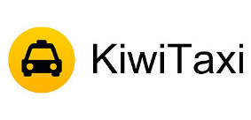

# Надежные сервисы для путешественников

Спасибо, что читаете нас и открыли эту страницу!
Вся информация в блоге бесплатна. Все сервисы, услуги и маршруты были проверены лично нами. Если вы нашли что-то полезное и хотите поблагодарить нас, то совершите покупку по одной из ссылок на этой странице. Для вас цена не изменится, а мы получим небольшую компенсацию.

## Авиабилеты

Мы покупаем авиабилеты на Aviasales.ru. Aviasales.ru позволяет сравнивать цены на авиабилеты от основных билетных агентств. Одна из самых наших любимых функций — отслеживание дешевых авиабилетов. Получать сообщения о снижении цен можно как на е-маил, так и в популярных сегодня мессенджерах Telegram, Facebook Messenger, Slack и т.д. Если времени на отслеживание дешевых авиабилетов уже нет, то спланировать путешествие поможет календарь низких цен.
Купить билеты на сайте Aviasales.ru.

## Отели

Booking.com предоставляет огромный выбор отелей по всему миру. На этом сайте нас привлекает удобный поиск со множеством разнообразных фильтров, огромная база отзывов. Если вы часто путешествуете, то со временем получаете специальные Genius-предложения. Все цены на сайте окончательные, в отеле с вас не потребуют дополнительных сборов. Есть возможность забронировать отель без предоплаты и без использования банковской карты.
Забронировать отель на Booking.com.

Если мы путешествуем по Юго-Восточной Азии, то пользуемся сайтом Agoda. На Agoda встречаются более выгодные предложения для путешественников по ЮВА чем на Booking.com. В случае, если есть какие-то недопонимания в отеле, не хотят заселять и т.п., поддержка сайта Agoda решает все вопросы в режиме 24/7.
Забронировать отель на Agoda.

Hotellook позволяет не пересматривать все сайты систем бронирования отелей вручную. На Hotellook собраны предложения более чем от 70 агентств. Когда нам надо сравнить цены и найти самый выгодный вариант, мы идем искать отели именно тут.
Найти самые выгодные предложения на Hotellook.

## Страховки

Пренебрегать оформлением туристической страховки нельзя. Мы на собственном опыте убедились, что хорошая туристическая страховка может здорово облегчить жизнь если кто-то заболеет в путешествии. На сайте Сherehapa.ru можно сравнить цены и условия от разных поставщиков страховых услуг, и выбрать оптимальный работающий вариант страховки для себя.
Сравнить цены и купить туристическую страховку на сайте Сherehapa.ru.

## Визы

На сайте VisaToHome вы можете оформить визу с доставкой на дом. К нашему сожалению, VisaToHome не занимается оформлением тайских виз, зато может с легкостью помочь с оформлением шенгенской визы или, например, визы в Индию. А найти актуальную информацию по оформлению таиской визы вы можете в нашей статье.
Заказать визу с доставкой на дом VisaToHome.

## Трансфер

В каждом новом месте нам надо решить задачу как добраться из аэропорта до нашего отеля. С этим хорошо справляется сервис онлайн-бронирования трансферов KiwiTaxi. Трансфер можно забронировать онлайн ко времени прилета вашего рейса. Водитель будет ждать вас с табличкой с вашим именем на выходе и доставит вас прямо до порога отеля.
Забронировать трансфер из аэропорта на KiwiTaxi.ru

## Поезда, паромы, автобусы

Во время путешествия по маршрутам внутри стран Юго-Восточной Азии, мы пользуемся сервисом 12go.asia. На этом сайте можно узнать все возможные способы как добраться из точки А в точку Б, и купить билеты на автобус, поезд, паром и т.д. Очень хороший сервис, иногда тут можно найти новый, более дешевый способ путешествовать по стране.
Купить билеты на паром, автобус, ж/д в ЮВА на 12go.asia.

## Аренда авто

На сайте Rentalcars.com вы можете арендовать автомобиль в любой точке мира. Rentalcars.com работает со множеством известных прокатных компаний. Вы можете сравнить цены, выбрать самый выгодный вариант, и забронировать его онлайн. Помимо, простоты бронирования и управления бронью, вы можете быть уверены, что автомобиль будет иметь базовое страховое покрытие. При желании, вы сможете расширить страховку до полной.
Забронировать автомобиль на rentalcars.com.

## Аренда байков

На сайте BikesBooking.com можно онлайн забронировать байк или велосипед. Арендованный транспорт будет доставлен к выбранному месту. Бронируя байк на BikesBooking.com вы получаете базовое страховое покрытие, при желании, можно расширить его до полного.
Забронировать байк или велосипед онлайн на BikesBooking.com.

Будем благодарны за денежную поддержку нашего проекта.

<iframe src="https://yoomoney.ru/quickpay/fundraise/widget?billNumber=b1SdhgPLNww.230831&" width="500" height="480" frameborder="0" allowtransparency="true" scrolling="no"></iframe>